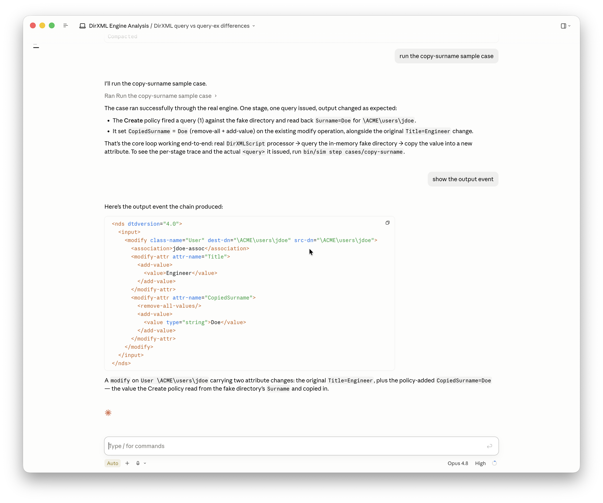

# DirXML Policy Simulator

A headless, agent-drivable test harness for NetIQ / OpenText Identity Manager
(DirXML) **channel policies**. It runs the IDM engine's *own* policy interpreter
(`DirXMLScriptProcessor`, XSLT, schema mapping) against author-supplied inputs —
no eDirectory, no running engine, no Designer — and lets you **step** through a
channel stage by stage, examining the document, trace, and directory
interactions at each step.

Higher fidelity than Designer's manual Policy Simulator (it's the real engine),
and scriptable so an agent can author inputs, run, read the trace, edit the
policy, and re-run in a loop.

> **New here?** Read [docs/intro.md](docs/intro.md) — a plain-English overview of
> what an agent can do with this, how you provide an export and traces, and
> example asks. Then [docs/quickstart.md](docs/quickstart.md) walks you from
> setup to stepping your own driver.



## What it does

- **Runs real policies headlessly** — the engine's `DirXMLScriptProcessor` with
  mocked query/command seams and a null Driver.
- **Per-stage stepping** — each channel stage is driven individually, capturing
  the XDS document entering and leaving it, the rule trace it produced, and the
  queries/commands it issued.
- **In-memory fake directory** — answers the queries a policy makes
  (`token-query`, `do-find-matching-object`, source/dest attribute reads) from
  loaded `<instance>` state, and absorbs write-back commands. Seed it from
  hand-authored `<instance>` XDS, a mined trace, or an **LDIF dump** of your vault.
- **Three driver-config sources** — assemble the actual subscriber/publisher chain
  (IDM policy-set order: event → matching → create → placement → command → schema
  mapping → output transform) from a **Designer export**, a **Designer project**,
  or an **LDIF/LDAP export of the live Identity Vault** (one subtree dump carries
  the policies, GCVs, filter, and shim params for the whole driver set).
- **Optional production-fidelity checks** — hand the chain's final command to the
  **real driver shim** to confirm it consumes the policy output, and/or answer
  queries from **live eDirectory over LDAP**. Both opt-in; off by default.
- **Real input events from a driver's cache** — with a live connection,
  `bin/sim dxcache` reads a **stopped** driver's event cache (its queued subscriber
  transactions) straight into a case, as an alternative to mining a trace. Uses
  DxCMD's LDAP extended ops; needs the optional `lib/ldap.jar`.
- **Real input events from the Event Logger DB** — `bin/sim dbevents` queries a
  **DirXML Event Logger** PostgreSQL history (by DN, driver, type, time) and writes
  each logged transaction as a pickable sample. Uses the open-source PostgreSQL
  JDBC driver, which Maven fetches automatically and releases bundle — no manual
  jar to stage.
- **Golden tests** — compare final output (and directory end-state) against
  recorded goldens; non-zero exit on mismatch.

## Requirements

- **JDK 21** — the 4.10.1 engine jars are Java 21 bytecode.
- Maven.
- **Nine proprietary NetIQ / OpenText jars in `lib/`** (gitignored — supply them
  yourself). These are the standard IDM driver-dependency set, found on an IDM
  **engine server** or **Remote Loader** install (and bundled with **Designer**):

  | jar | provides |
  |---|---|
  | `dirxml.jar` | the IDM engine + policy interpreter (the core) |
  | `dirxml_misc.jar` | engine support classes |
  | `nxsl.jar` | XPath / XSLT / DirXML Script engine |
  | `xp.jar` | the Novell XML parser / DOM |
  | `xds.jar` (as `XDS.jar`) | XDS document support |
  | `jclient.jar` | eDirectory client types (referenced, not connected) |
  | `dhutil.jar` | low-level NDS utilities |
  | `CommonDriverShim.jar` | driver shim base types |
  | `js.jar` | repackaged Rhino — ECMAScript `es:` functions |

  Match the version you target (this project uses **4.10.1**). On a server these
  live in the engine/Remote-Loader classpath (e.g. an `.../lib` directory); copying
  a driver's full dependency set is the easy way to get them all. Run
  `bin/sim doctor` to confirm the set is complete.

  **Optional 10th jar** — `ldap.jar` (Novell/OpenText JLDAP SDK, `com.novell.ldap`;
  ships with IDM and Designer) is needed only for the **DxCMD** features
  (`bin/sim dxcache`, reading a driver's event cache). Everything else runs without
  it.

## Install from a release (no build)

Grab `dirxml-simulator-<ver>.zip` from the
[releases](https://github.com/PointBlueTechnology/DirXMLSimulator/releases), unzip
it, drop your nine NetIQ jars into its `lib/`, and run — no clone, no Maven:

```bash
unzip dirxml-simulator-*.zip && cd dirxml-simulator-*
cp /path/to/idm/*.jar lib/      # the 9 jars listed under Requirements
bin/sim doctor                  # -> DOCTOR: OK   (Windows: bin\sim.cmd doctor)
```

The archive bundles the compiled jar, the launchers (`bin/sim` for macOS/Linux,
`bin/sim.cmd` for Windows), the skill, sample cases, and docs. The proprietary
jars are never bundled — you supply them.

## Build from source & test

```bash
export JAVA_HOME=.../zulu-21
mvn test                        # run the suite
./tools/build-dist.sh           # build the release archive (target/dist/…zip)
```

## Install it as a Claude Code skill

This project ships a Claude Code **skill** (`.claude/skills/dirxml-policy-testing/`)
that teaches an agent to drive the harness — the author → run → step → test loop,
the case format, and the `bin/sim` commands. That's what turns "test this policy"
into something an agent does for you (see [docs/intro.md](docs/intro.md)).

**Working in this repo — nothing to install.** Open the DirXMLSimulator project in
Claude Code and the project skill is active automatically. Ask the agent to test or
debug a policy and it uses the skill (and `bin/sim`) on your behalf.

**Use it from anywhere — install globally.** To make the skill available in any
Claude Code session (e.g. while you're in a Designer project), copy or symlink it
into your user skills directory:

```bash
# from the repo root — symlink so it tracks updates to the skill
ln -s "$(pwd)/.claude/skills/dirxml-policy-testing" ~/.claude/skills/dirxml-policy-testing
# …or copy it
cp -R .claude/skills/dirxml-policy-testing ~/.claude/skills/
```

The skill drives the `bin/sim` CLI, so the **built harness must be reachable**:
keep this repo checked out and built (`mvn compile`, then `bin/sim doctor` → `OK`),
and either run the agent from inside it or tell the agent where the project lives.

**Using it.** The agent selects the skill automatically from its description when
you ask about IDM / DirXML policy testing, tracing, or debugging; you can also
invoke it by name (`dirxml-policy-testing`) in clients that list skills. Hand it a
driver export and a trace and ask in plain English — see
[docs/intro.md](docs/intro.md) for example asks.

### Other agents (Codex, Cursor, Copilot, etc.)

The skill is just markdown plus a CLI, so any coding agent can drive the harness.
The substance — how to run it, the case format, trace reading — is in
[AGENTS.md](AGENTS.md) (the cross-agent standard many tools read automatically)
and the skill's `SKILL.md` + `reference/` files. Wire it into your tool of choice:

- **OpenAI Codex / Jules / Factory / Cursor (agent mode)** — read `AGENTS.md`
  automatically; no setup needed once the repo is open.
- **Cursor (rules)** — add a rule that points at the harness:
  ```bash
  mkdir -p .cursor/rules
  printf -- '---\ndescription: Test/debug IDM (DirXML) policies with bin/sim\nalwaysApply: false\n---\nSee AGENTS.md and .claude/skills/dirxml-policy-testing/SKILL.md. Drive the harness via bin/sim.\n' > .cursor/rules/dirxml-policy-testing.mdc
  ```
- **GitHub Copilot** — point its repo instructions at the guide:
  ```bash
  mkdir -p .github
  echo 'For IDM / DirXML policy testing, use the harness via bin/sim — see AGENTS.md and .claude/skills/dirxml-policy-testing/SKILL.md.' >> .github/copilot-instructions.md
  ```
- **Any other agent** — tell it to read `AGENTS.md` (and the skill's `SKILL.md` /
  `reference/`) and drive the `bin/sim` CLI.

In every case the agent still needs the **built harness reachable** (JDK 21,
`lib/` jars, `bin/sim doctor` → `OK`), exactly as above.

## CLI

```bash
bin/sim run    <caseDir> [--trace]   # run chain, print final output (+ trace)
bin/sim step   <caseDir>             # per-stage input/output/queries/trace
bin/sim test   <caseDir>             # diff vs expected-*.xds; exit !=0 on mismatch
bin/sim record <caseDir>             # write expected-output.xds / expected-directory.xds
```

### Case layout

```
cases/<name>/
  case.properties        # driverDN, dnFormat, fromNDS, traceLevel; OR a config source (below)
  chain.txt              # ordered stages: "stageName = policy.xml" per line
  input.xds              # the operation to run
  directory.xds          # optional: initial fake-directory state (<instance> set)
  gcv.xml                # optional: GCV definitions
  expected-output.xds    # golden (written by `record`)
  expected-directory.xds # optional golden: directory end-state
```

To drive the chain from a real driver instead of `chain.txt`, set one config
source in `case.properties` (with `channel=publisher|subscriber`):

```
export=../../MyDriver.xml                       # a Designer driver export
# project=/path/to/designer_workspace + driver=MyDriver   # a Designer project
# ldifConfig=/path/to/IDM_subtree.ldif + driver=MyDriver  # a live-vault LDIF export
```

An **LDIF/LDAP export of the live vault** is often easiest — one subtree dump
carries the whole driver set's policies, GCVs, filter, and shim params, and can
also seed the fake directory (`ldif=that-file.ldif`). The LDIF must include the
DirXML data attributes (a plain `ldapsearch *` omits them); the
[skill reference](.claude/skills/dirxml-policy-testing/reference/xds-and-cases.md)
gives the exact `ldapsearch` command. Optional, opt-in: `shim=true` drives the
real connector with the chain's output; `ldap=ldaps://…` answers queries from live
eDir.

## Layout

`src/main/java/com/pointblue/dirxml/sim/`
- `EngineContext` — builds the headless `RuleStaticContext` + captured trace.
- `CaptureEngineTrace` — captures the rule-by-rule policy trace to a buffer.
- `PolicyLoader` / `PolicyStage` — load a `<policy>`/`<style-sheet>`/`<attr-name-map>`
  and wrap it as a channel stage.
- `FakeDirectory` — in-memory directory implementing the query/command seams.
- `ChannelSimulator` — drives an ordered stage list, capturing `StageSnapshot`s;
  optional live-LDAP query source and real-shim command sink.
- `DriverExport` / `DesignerProject` / `LdifDriverSource` — assemble channel chains
  from a driver export, a Designer project, or a live-vault LDIF export.
- `LdifReader` — seed the fake directory from an LDIF dump.
- `LdapValueNormalizer` / `LdapQueryProcessor` / `JndiLdapSearch` — map LDAP↔native
  XDS by schema syntax; answer queries from live eDir.
- `ShimAdapter` / `InitDocBuilder` / `ShimConfig` — drive a real driver shim.
- `Case` / `XmlCompare` / `Cli` — the case model, golden compare, and CLI.
